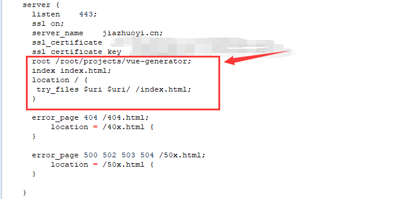
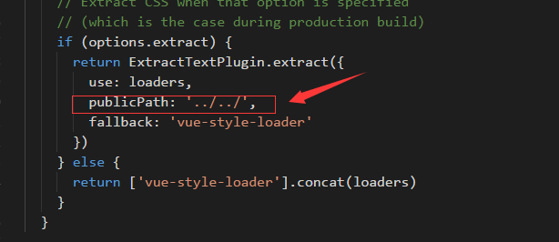
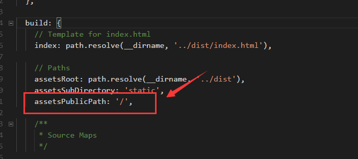

##### 1.嵌套路由刷新404问题

vue-router默认是mode为hash，这个时候url会带上#号，当你使用history模式是，url就去掉了#。[https://jiazhuoyi.cn/my/info](https://jiazhuoyi.cn/my/info) 时，因为该项目时单页面应用，本地路径中没有这个真实资源的存在（这里的嵌套路由是在js里面渲染的），所以当我们直接输入[https://jiazhuoyi.cn/my/info](https://jiazhuoyi.cn/my/info)或者在[https://jiazhuoyi.cn/my/info](https://jiazhuoyi.cn/my/info)下刷新，会出现404。

解决办法:

方法有几种，我采用的是在nginx中修改配置

根据vue-router官方的建议（[HTML5 History 模式](https://router.vuejs.org/zh/guide/essentials/history-mode.html)），使用nginx的try_files指令，将uri重定向到index.html

##### 2.静态资源路径错误

静态资源找不到，发现是路径的问题

查看引入的图片资源路径如下：[http://ip:port/public/springActivity/static/css/static/img/question_bg.61a2825.png](http://ip:port/public/springActivity/static/css/static/img/question_bg.61a2825.png)

解决办法：

修改build目录下的utils.js文件

然后会出现这个问题（因为嵌套路由导致静态资源的路径加上了嵌套的前缀）：

是因为webpack配置中是./相对路径，所以会带上url前缀。

解决办法：

修改config目录下的index.js

